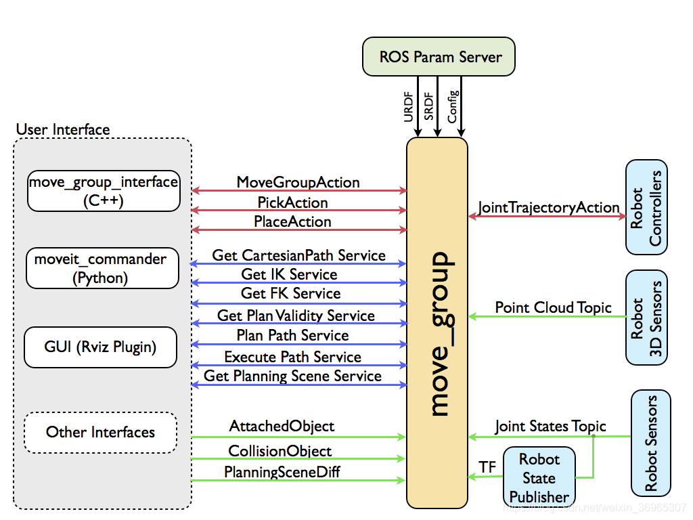

## MoveIt基础功能
* **运动规划(Motion Planning)**：要让一个机器人实现运动规划，需要先将机器人抽象到构形空间(C-Space)。MoveIt就可以帮大家把这些工作给做了，只需提供机器人URDF模型，就可以调用几大运动规划库的规划算法(如 OMPL，SBPL，CHMOP)，自动生成机器人运动轨迹。
* **运动学(Kinematics)**：运动学机器人工作空间与构形空间（C-Space）的映射关系，所以MoveIt就它也包括在自己系统内。目前它可以支持多种运动学求解器，如OpenRave的ikfast（封闭解）、Orocos的KDL（数值解）、Trac_ik（考虑关节极限的数值解）、基 于service的求解器（用户自己定义）。
* **碰撞检测(Collision Checking)**：碰撞检测是运动规划的一大难题，如果采用基于采样的规划算法，那么我们需要对每个采样点做有效性判断，这时候就需要进行碰撞检测。所以，运动规划需要提供一个高效的碰撞检测算法。香港城市大学的潘佳写了个FCL（Flexible Collision Library），可以非常快速地实现各种几何体（3D面片、OctoMap、基本几何体）的碰撞检测。
* **轨迹插值(Trajectory Processing)**：由于大多数规划器只能返回一系列路径点，MoveIt可以根据机器人的控制参数（速度、加速度限制等）重新处理路径，生成一条带有时间戳、位置、速度、加速度信息的完整轨迹。
* **控制(Controll)**：由于不同机器人的控制接口都不一样，Moveit提供一个机器人控制接口，开发者只需简单修改配置文件，就可以让MoveIt发布出机器人相应的控制指令（只是修改action名字而已）。
* **3D感知(Perception)**：它可以利用传感器采集的信息（点云或深度图像）生成用于碰撞检测的OctoMap（以八叉树形式表示点云，可以大大降低存储空间）。同时，这些3D OctoMap也可以依据贝叶斯准则不断实时更新。这样，机器人就可以避开真实世界的障碍物了。

## MoveIt通讯机制
`/move_group`是MoveIt的核心节点，主要实现以下两大功能：
* 发布关节角度
如果连接实际机器人，MoveIt需要从机器人当前状态开始规划，因此这个ROS驱动需要能够实时获取机器人的各关节信息（如角度），并通过`/joint_states`消息发布；
* 接收规划结果并下发给机器人
由于MoveIt规划的结果会以一个action的形式发布，所以我们的ROS驱动就应该提供一个action server，这个功能就是接收规划结果，下发给机器人，并反馈执行情况。action的类型是`control_msgs/FollowJointTrajectory`。

运行demo.launch后的ROS节点图如下图所示：

`move_group`与外部的交互与通讯框架如下图所示:


## MoveIt源码分析

MoveIt中最重要的类有`PlanningPipeline`,`OMPLPlannerManager`,`ModelBasedPlanningContext`，其中在`OMPLPlannerManager`中加载OMPL的配置参数，在`ModelBasedPlanningContext`中求解运动规划问题。各主要代码架构如下图所示：


### 1. main(argc,argv)
源码地址：`/move_group(/moveit_ros/move_group/src/move_group.cpp)`
```C++
// Load MoveItCpp parameters and check for valid planning pipeline configuration
// 1.1 初始化moveit_cpp配置参数
ros::NodeHandle pnh("~");
moveit_cpp::MoveItCpp::Options moveit_cpp_options(pnh);

// Initialize MoveItCpp
// 1.2 初始化moveit_cpp
const auto tf_buffer = std::make_shared<tf2_ros::Buffer>(ros::Duration(10.0));
const auto moveit_cpp = std::make_shared<moveit_cpp::MoveItCpp>(moveit_cpp_options, pnh, tf_buffer);
const auto planning_scene_monitor = moveit_cpp->getPlanningSceneMonitor();

// Initialize MoveGroupExe
// 1.3 初始化mge
move_group::MoveGroupExe mge(moveit_cpp, default_planning_pipeline, debug);
mge.status();
```
#### 1.1 初始化moveit_cpp配置参数
源码地址：`/moveit_ros/planning/move_cpp/include/move_cpp.h`
`moveit_cpp_options`的初始化主要就是从ROS server中获取配置参数的过程，无须赘述

#### 1.2 初始化moveit_cpp
源码地址：`/moveit_ros/planning/move_cpp/src/move_cpp.cpp`
```C++
// Configure planning scene monitor
loadPlanningSceneMonitor(options.planning_scene_monitor_options);

robot_model_ = planning_scene_monitor_->getRobotModel();
loadPlanningPipelines(options.planning_pipeline_options);
trajectory_execution_manager_ = std::make_shared<trajectory_execution_manager::TrajectoryExecutionManager>(
    robot_model_, planning_scene_monitor_->getStateMonitor());

```
`moveit_cpp`重要函数：
```C++
/** \brief Execute a trajectory on the planning group specified by group_name using the trajectory execution manager.
 * If blocking is set to false, the execution is run in background and the function returns immediately. */
bool execute(const std::string& group_name, const robot_trajectory::RobotTrajectoryPtr& robot_trajectory,
            bool blocking = true);
```


#### 1.3 初始化mge
源码地址：`/moveit_ros/move_group/src/move_group.cpp`
```C++
// mge中初始化context_
context_ =
    std::make_shared<MoveGroupContext>(moveit_cpp, default_planning_pipeline, allow_trajectory_execution, debug);
// mge中加载MoveGroupCapability
configureCapabilities()
{
    capability_plugin_loader_ = std::make_shared<pluginlib::ClassLoader<MoveGroupCapability>>(
        "moveit_ros_move_group", "move_group::MoveGroupCapability");
    for (const std::string& capability : capabilities)
    {
        MoveGroupCapabilityPtr cap = capability_plugin_loader_->createUniqueInstance(capability);
        cap->setContext(context_);
        cap->initialize();
        capabilities_.push_back(cap);
    }
}
```

##### 1.3.1 初始化move_group_context
源码地址：`/moveit_ros/move_group/src/move_group_context.cpp`
```C++
planning_pipeline_ = default_pipeline_it->second;
trajectory_execution_manager_ = moveit_cpp_->getTrajectoryExecutionManager();
plan_execution_ =
    std::make_shared<plan_execution::PlanExecution>(planning_scene_monitor_, trajectory_execution_manager_);
plan_with_sensing_ = std::make_shared<plan_execution::PlanWithSensing>(trajectory_execution_manager_);
```

##### 1.3.2 加载MoveGroupCapability
源码地址：`/moveit_ros/move_group/src/move_group_capability.cpp`
`MoveGroupCapability`是一个接口类，`mge`根据配置参数`ros param`加载各个`MoveGroupCapability`实例并完成该实例的初始化。本质上，各个类型`MoveGroupCapability`的初始化就是开辟相应功能的`ROS ServiceServer`，响应外部`ROS ServiceClient`的请求。

以`MoveGroupPlanService`为例，源码地址：`/moveit_ros/move_group/src/default_capabilities/plan_service_capability.cpp`
```C++
// 初始化ServiceServer
void MoveGroupPlanService::initialize()
{
    plan_service_ =
        root_node_handle_.advertiseService(PLANNER_SERVICE_NAME, &MoveGroupPlanService::computePlanService, this);
}

// 响应外部请求
bool MoveGroupPlanService::computePlanService(moveit_msgs::GetMotionPlan::Request& req,
                                              moveit_msgs::GetMotionPlan::Response& res)
{
    // Select planning_pipeline to handle request
    const planning_pipeline::PlanningPipelinePtr planning_pipeline =
        resolvePlanningPipeline(req.motion_plan_request.pipeline_id);

    planning_interface::MotionPlanResponse mp_res;
    planning_pipeline->generatePlan(ps, req.motion_plan_request, mp_res);
    mp_res.getMessage(res.motion_plan_response);
}
```

###### 1.3.2.1 响应PlanService-PlanningPipeline
源码地址：`/moveit_ros/planning/planning_pipeline/src/planning_pipeline.cpp`
```C++
// load the planning plugin
planner_plugin_loader_ = std::make_unique<pluginlib::ClassLoader<planning_interface::PlannerManager>>(
    "moveit_core", "planning_interface::PlannerManager");
planner_instance_ = planner_plugin_loader_->createUniqueInstance(planner_plugin_name_);
// load the planner request adapters
adapter_plugin_loader_ =
    std::make_unique<pluginlib::ClassLoader<planning_request_adapter::PlanningRequestAdapter>>(
        "moveit_core", "planning_request_adapter::PlanningRequestAdapter");
ad = adapter_plugin_loader_->createUniqueInstance(adapter_plugin_name);
ad->initialize(pipeline_nh_);
adapter_chain_ = std::make_unique<planning_request_adapter::PlanningRequestAdapterChain>();
adapter_chain_->addAdapter(ad);
```
`PlanningPipeline`重要函数：
```C++
/** \brief Call the motion planner plugin and the sequence of planning request adapters (if any).
     \param planning_scene The planning scene where motion planning is to be done
    \param req The request for motion planning
    \param res The motion planning response
    \param adapter_added_state_index Sometimes planning request adapters may add states on the solution path (e.g.,
    add the current state of the robot as prefix, when the robot started to plan only from near that state, as the
    current state itself appears to touch obstacles). This is helpful because the added states should not be considered
    invalid in all situations. */
bool generatePlan(const planning_scene::PlanningSceneConstPtr& planning_scene,
                const planning_interface::MotionPlanRequest& req, planning_interface::MotionPlanResponse& res,
                std::vector<std::size_t>& adapter_added_state_index) const;

// 具体为通过调用adapter_chain_来实现规划
solved = adapter_chain_->adaptAndPlan(planner_instance_, planning_scene, req, res, adapter_added_state_index);
```

MoveIt运动规划功能的实现最终落脚到PlanningPipeline，他有两个重要成员变量：`planning_interface::PlannerManagerPtr planner_instance_`和`std::unique_ptr<planning_request_adapter::PlanningRequestAdapterChain> adapter_chain_`，通过`planning_plugin_name`和`adapter_plugin_names`去定义PlanningPipeline的规划器与适配器


### 2. 实现PlannerManager
源码地址：`/moveit_planners/ompl/ompl_interface/src/ompl_planner_manager.cpp`
```C++
class OMPLPlannerManager : public planning_interface::PlannerManager
{
    ompl_interface_ = std::make_unique<OMPLInterface>(model, nh_);
}
```

#### 2.1 初始化OMPLInterface
源码地址：`/moveit_planners/ompl/ompl_interface/src/ompl_interface.cpp`
```C++
/** \brief Initialize OMPL-based planning for a particular robot model. ROS configuration is read from the specified
 NodeHandle. However,
    planner configurations are used as specified in \e pconfig instead of reading them from the ROS parameter server
    */
OMPLInterface(const moveit::core::RobotModelConstPtr& robot_model,
            const planning_interface::PlannerConfigurationMap& pconfig,
            const ros::NodeHandle& nh = ros::NodeHandle("~"));
// 初始化PlanningContextManager
context_manager_(robot_model, constraint_sampler_manager_)
```

##### 2.1.1 初始化PlanningContextManager
源码地址：`/moveit_planners/ompl/ompl_interface/src/planning_context_manager.cpp`
```C++
/** \brief Returns a planning context to OMPLInterface, which in turn passes it to OMPLPlannerManager.
 *
 * This function checks the input and reads planner specific configurations.
 * Then it creates the planning context with PlanningContextManager::createPlanningContext.
 * Finally, it puts the context into a state appropriate for planning.
 * This last step involves setting the start, goal, and state validity checker using the method
 * ModelBasedPlanningContext::configure.
 *
 * */
ModelBasedPlanningContextPtr getPlanningContext(const planning_scene::PlanningSceneConstPtr& planning_scene,
                                                const planning_interface::MotionPlanRequest& req,
                                                moveit_msgs::MoveItErrorCodes& error_code, const ros::NodeHandle& nh,
                                                bool use_constraints_approximations) const;
```


